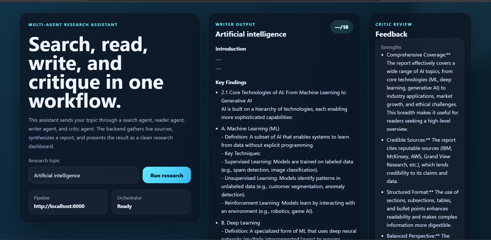

# Multi-Agent Research System

A **4-stage research system** built using **LangChain**, **Mistral AI**, **Tavily Search**, and **BeautifulSoup** that autonomously searches the web, extracts relevant information, generates a structured research report, and performs AI-based critique for quality assurance. The system exposes a **FastAPI** backend, enabling seamless integration with modern frontend applications.

<p align="center">
  
</p>

---

## ✨ Features

- 🔍 AI-powered web search using Tavily Search
- 🌐 Intelligent webpage scraping with BeautifulSoup
- 📝 Automated research report generation
- 🤖 AI-based report review and quality feedback
- ⚡ FastAPI backend with REST APIs
- 🎨 React (Vite + TypeScript) frontend integration
- 🔒 Secure API key management using `.env`
- 🚀 Modular multi-agent architecture

---

# 🏗️ System Architecture

```text
User
  |
  v
React Frontend (Vite + TypeScript)
  |
  |  POST /research with { topic }
  v
FastAPI Backend
  |
  |  validates input with Pydantic
  |  allows browser access with CORS
  |  runs long work in a thread
  v
Research Pipeline
  |
  +--> Search Agent ----> Tavily web search
  |
  +--> Reader Agent -----> requests + BeautifulSoup scrape web page
  |
  +--> Writer Chain ------> generates structured report
  |
  +--> Critic Chain ------> reviews report and gives score
  |
  v
Structured JSON Response
  |
  v
Frontend Dashboard
  |
  +--> Introduction
  +--> Key Findings
  +--> Conclusion
  +--> Sources
  +--> Feedback / Score
  +--> Raw search and scrape output
```

---

# ⚙️ Tech Stack

## Backend

- FastAPI
- Python
- Pydantic

## AI & LLM

- LangChain
- LangGraph
- Mistral AI

## Research Tools

- Tavily Search API
- BeautifulSoup
- Requests

## Frontend

- React
- Vite
- TypeScript

## Utilities

- Python Dotenv
- Rich

---

# 📂 Project Structure

```text
multi_agent/
│
├── app/
│   ├── __init__.py
│   ├── api.py
│   ├── agents.py
│   ├── pipeline.py
│   ├── tools.py
│   └── requirements.txt
│
├── frontend/
│
├── assets/
│   └── dashboard.png
│
├── .env.example
├── .gitignore
└── README.md
```

---

# 🚀 Installation

## 1. Clone the repository

```bash
git clone https://github.com/pr3etk/multi_agent_research_system.git

cd multi_agent_research_system
```

---

## 2. Create a virtual environment

```bash
python -m venv .venv
```

### Windows

```bash
.venv\Scripts\activate
```

### Linux / macOS

```bash
source .venv/bin/activate
```

---

## 3. Install dependencies

```bash
pip install -r app/requirements.txt
```

---

## 4. Configure Environment Variables

Create a `.env` file in the project root.

```env
MISTRAL_API_KEY=your_mistral_api_key
TAVILY_API_KEY=your_tavily_api_key
```

---

# ▶️ Running the Backend

```bash
uvicorn app.api:app --reload
```

Backend API

```
http://127.0.0.1:8000
```

Swagger Documentation

```
http://127.0.0.1:8000/docs
```

---

# 💻 Running the Frontend

```bash
cd frontend

npm install

npm run dev
```

Frontend

```
http://localhost:5173
```

---

# 📡 API

## POST `/research`

### Request

```json
{
  "topic": "Latest developments in AI Agents"
}
```

### Response

```json
{
  "search_result": "...",
  "reader_result": "...",
  "report": "...",
  "feedback": "..."
}
```

---

# 🔄 Workflow

1. User enters a research topic in the React frontend.
2. FastAPI validates the request using Pydantic.
3. Search Agent performs a live web search using Tavily.
4. Reader Agent scrapes the most relevant webpage using BeautifulSoup.
5. Writer Chain generates a structured research report.
6. Critic Chain reviews the report and provides feedback.
7. FastAPI returns a structured JSON response.
8. The frontend renders the report in a clean dashboard.

---

# 📊 Frontend Dashboard

The dashboard displays:

- 📖 Introduction
- 🔑 Key Findings
- 📚 Detailed Research Report
- 📌 Conclusion
- 🌐 Sources
- ⭐ Critic Feedback & Quality Score
- 📝 Raw Search Results
- 📄 Raw Scraped Content

---

# 🔮 Future Improvements

- Real-time streaming using Server-Sent Events (SSE)
- WebSocket support
- Parallel multi-source research
- PDF report generation
- Research history
- User authentication
- Vector database integration
- Multi-LLM support (OpenAI, Gemini, Claude, Mistral)
- Docker deployment
- AWS deployment
- CI/CD using GitHub Actions

---

# 🤝 Contributing

Contributions are welcome!

1. Fork the repository.
2. Create a new feature branch.
3. Commit your changes.
4. Push your branch.
5. Open a Pull Request.

